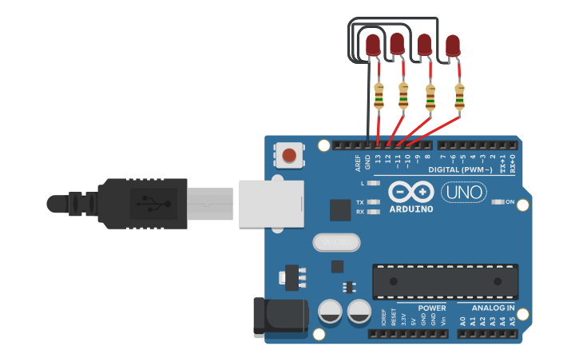
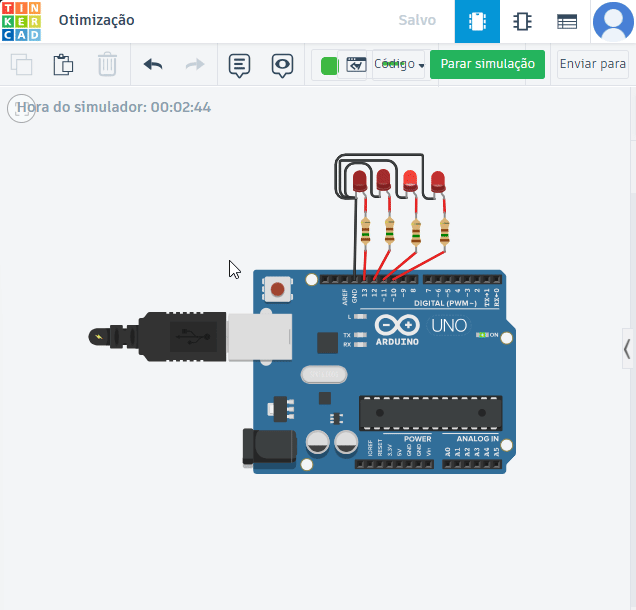

# Prática 01 - Sequência de LEDs

##  Descrição

Este projeto é uma prática simples de controle de LEDs utilizando **Arduino UNO** e **linguagem C++**.  
A proposta consiste em acender 4 LEDs em sequência, com um pequeno intervalo entre eles, criando um efeito visual semelhante a uma animação de pisca-pisca.  

Foi pensado como **introdução à manipulação de pinos digitais** no Arduino.

---

##  Materiais Utilizados

- 1x Arduino UNO  
- 4x LEDs vermelhos  
- 4x Resistores de 220Ω  
- Jumpers macho-macho  

---

