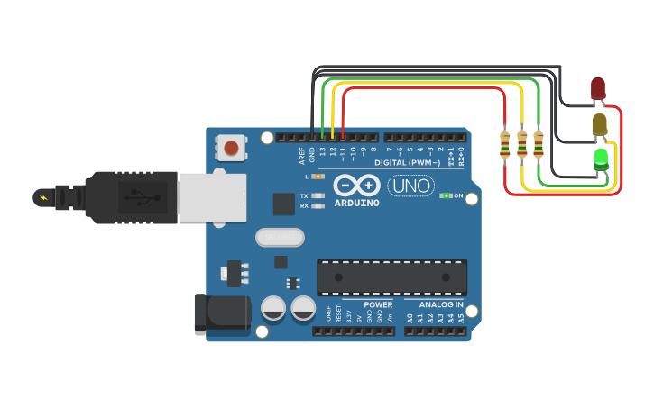
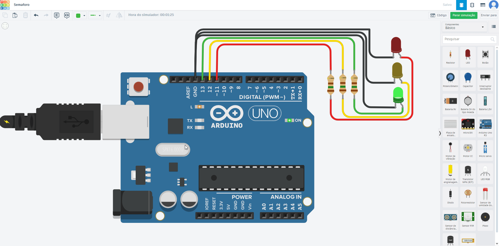

# Prática 01 - Semáforo simples

##  Descrição

Este projeto é uma prática introdutória de eletrônica com Arduino, focada no controle de LEDs para simular um **semáforo simples**. 

A lógica consiste em acender os LEDs nas cores **verde, amarelo e vermelho**, com tempos diferentes, representando o funcionamento de um semáforo real. É ideal para iniciantes aprenderem sobre:
- Manipulação de pinos digitais
- Controle de tempo com ``delay()``
- Estrutura sequencial de código

---

##  Materiais Utilizados

- 1x Arduino UNO
- 1x LED vermelho
- 1x LED amarelo
- 1x LED verde
- 3x Resistores de 220Ω
- Jumpers macho-macho

---

