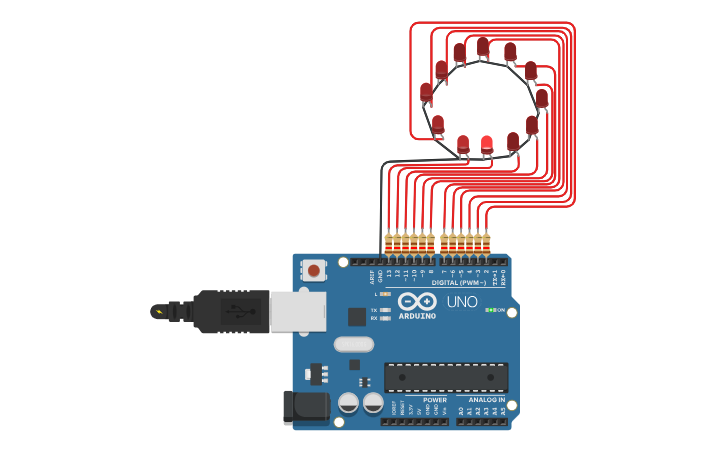

# Prática 03 - Anel Sequencial de LEDs

##  Descrição

Este projeto consiste em criar um **anel sequencial de LEDs** utilizando o **Arduino UNO**, simulando um efeito visual de movimento circular.

Os LEDs são acesos um por um em sequência circular, gerando um efeito semelhante ao de luzes de **decoração** ou **indicadores visuais animados.**

---

##  Materiais Utilizados

- 1x Arduino UNO
- 12x LEDs vermelhos
- 12x Resistores de 220Ω
- Jumpers macho-macho

---

