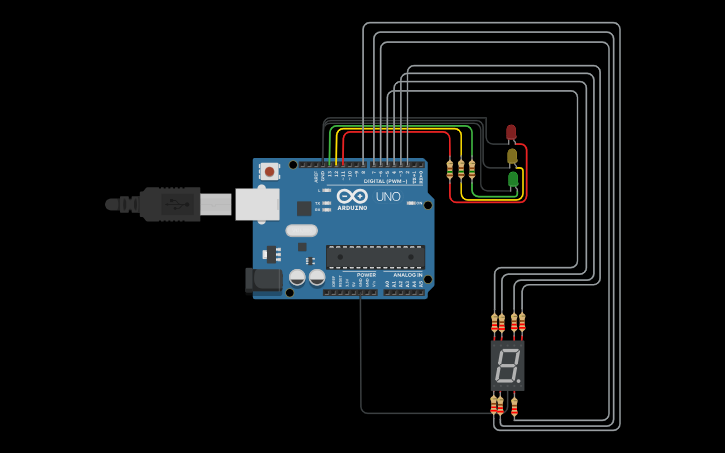
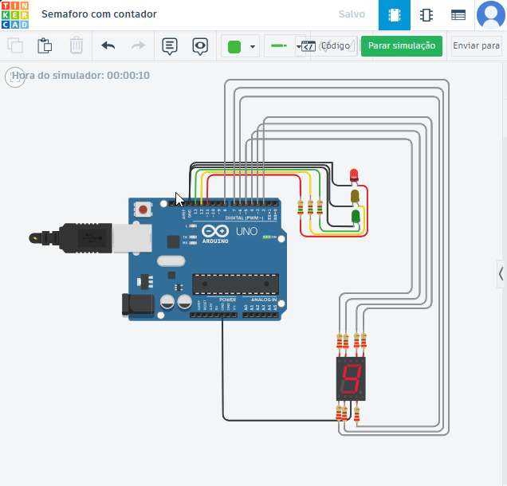

# Prática 04 - Semáforo melhorado

##  Descrição

Este projeto consiste em criar um **Semáforo um pouco mais complexo** utilizando o **Arduino UNO** e um **display de 7 segmentos** para criar um contador, inspirado em semáforos reais com contador de tempo das luzes.

Os LEDs são acesos um por um em sequência circular, gerando um efeito semelhante ao de luzes de **decoração** ou **indicadores visuais animados.**

---

##  Materiais Utilizados

- 1x Arduino UNO
- 1x LED vermelho
- 1x LED amarelo
- 1x LED verde
- 3x Resistores de 150Ω
- 7x Resistores de 250Ω
- 1x Display de 7 segmentos 
- Jumpers macho-macho

---

