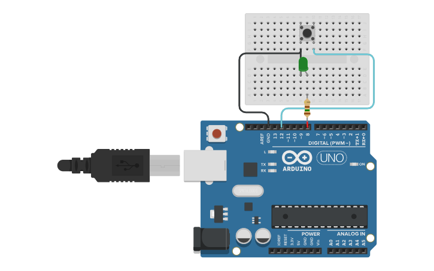
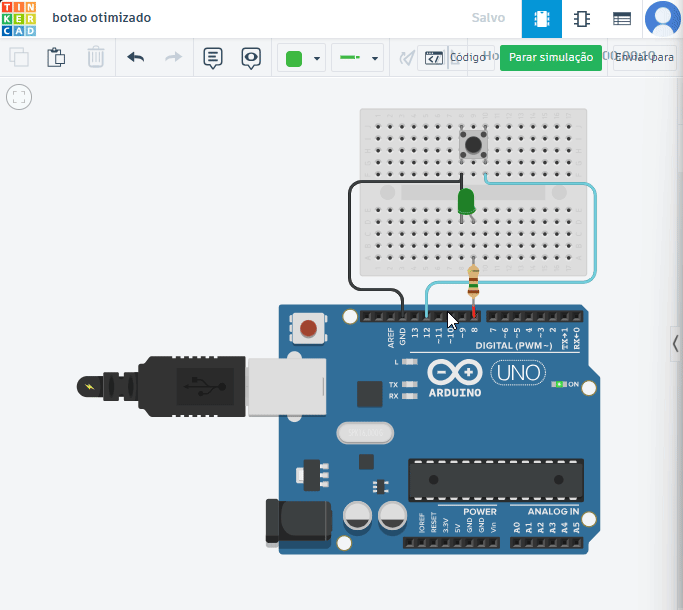

# Prática 05 - Controle de LED com Botão

##  Descrição

Este projeto tem como objetivo **aprender o uso de botões no Arduino** para controlar um LED.
Ao pressionar o botão, o LED acende; ao soltar, ele apaga.

Esse tipo de circuito é a base para criar **interfaces físicas simples**, como painéis de controle, jogos interativos e sistemas de entrada de dados.

---

##  Materiais Utilizados

- 1x Arduino UNO
- 1x LED verde
- 1x Resistor de 150Ω
- 1x Botão (push button)
- Jumpers macho-macho
- 1x Protoboard

---

